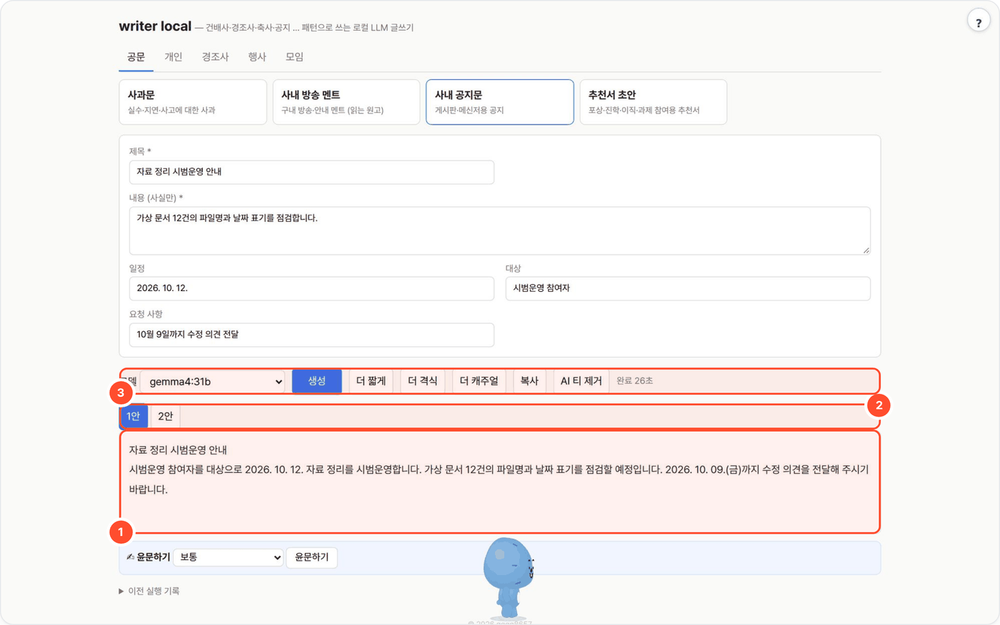
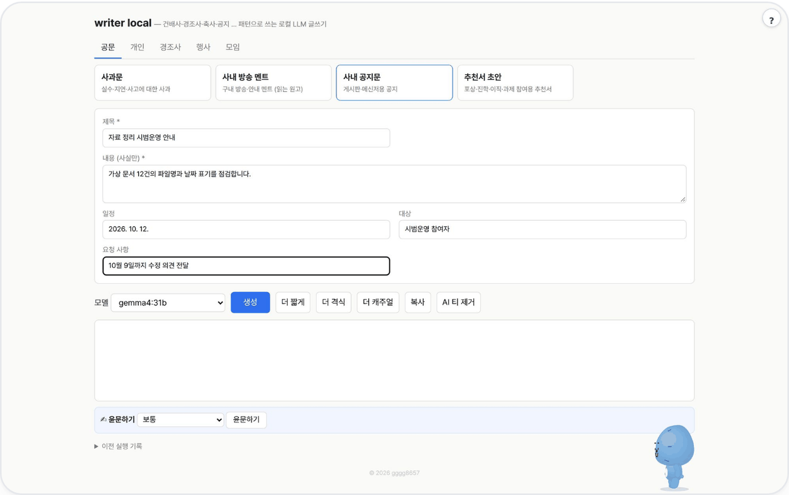

# writer-local — 형식이 있는 글을 입력 몇 칸으로

건배사·경조사 문구·축사·공지문·감사 편지처럼 형식이 정해진 글을 17개 패턴에서 골라, 입력 몇 칸만 채우면 로컬 LLM이 여러 안으로 써 주는 웹 UI / CLI입니다.



## 무엇을 하나

- "패턴 = 마크다운 파일 하나"로 글 종류를 묶습니다. 패턴의 입력 정의가 화면의 폼을 만들고, 패턴마다 작성 규칙과 안 개수가 다릅니다. [Fabric](https://github.com/danielmiessler/Fabric)의 패턴 방식을 공공기관·연구소 한국어 글쓰기에 맞춰 새로 썼습니다.
- 폼에 사실만 넣으면 여러 안이 나오고, **더 짧게 · 더 격식 · 더 캐주얼** 버튼으로 다시 씁니다. humanize-kr-local이 떠 있으면 **AI 티 제거**, kordoc-local이 떠 있으면 **✍ 윤문하기**까지 이어집니다.
- 의존성 없음(Python 3.9+ 표준 라이브러리). 패턴 추가는 `patterns/이름.md` 한 파일, 코드 수정 없음.

## 사용 방법

포털 경유(`http://<포털>:8700/t/writer-local/`) 또는 단독 실행(`http://localhost:8773`) 화면에서:

1. **카테고리와 패턴을 고른다** — 모임·경조사·행사·공문·개인 탭에서 필요한 글의 패턴 카드를 선택합니다.
2. **사실을 채우고 생성한다** — 패턴에 맞게 생긴 입력 칸(제목·내용·일정·대상 등)을 채우고 **생성**. 선택한 안의 본문이 나옵니다. (그림 ①)
3. **안을 비교하고 다듬는다** — `1안`·`2안` 탭을 전환해 읽고(그림 ②), **더 짧게 / 더 격식 / 더 캐주얼**로 다시 쓴 뒤(그림 ③) **복사**합니다.

패턴은 구조를 제공할 뿐이니, 사용 전 날짜와 문구를 확인하세요.

## 예시

가상 자료 정리 사례로 **공문 → 사내 공지문** 패턴을 `gemma4:31b`로 실제 실행했습니다. 이 패턴은 사실과 요청을 앞에 두고 게시판용과 짧은 메신저용 2안을 만듭니다.

입력:

```text
제목: 자료 정리 시범운영 안내
내용: 가상 문서 12건의 파일명과 날짜 표기를 점검합니다.
일정: 2026. 10. 12.
대상: 시범운영 참여자
요청: 10월 9일까지 수정 의견 전달
```

출력 (2안 · 메신저용):

```text
자료 정리 시범운영 안내
시범운영 참여자분들은 2026. 10. 12. 진행되는 가상 문서 12건의 파일명 및 날짜 표기 점검에 참여해 주세요. 10월 9일까지 수정 의견 전달해 주시기 바랍니다.
```

1안은 입력한 "10월 9일"을 "2026. 10. 09.(금)"으로 풀어 썼습니다(위 그림 ①).

<details><summary>입력 화면</summary>



</details>

## 실행

```bash
bash setup.sh                     # OS 감지 → Python → LLM 탐색/세팅 → selftest → http://localhost:8773
python3 app.py                    # 수동
LLM_API=openai LLM_BASE_URL=http://gpu:8000/v1 LLM_MODEL=Qwen3-32B python3 app.py
python3 app.py --cli toast occasion=송년회 mood=유쾌하게 length=30초 "note=신입 김민수 환영"
python3 selftest.py               # LLM 없이 패턴 로더·안 분리·CLI 검증
```

| 환경변수 | 기본 | 설명 |
|---|---|---|
| `LLM_API` | `ollama` | `ollama` 또는 `openai` |
| `LLM_BASE_URL` | `http://localhost:11434` / `http://localhost:8000/v1` | 서버 주소 |
| `LLM_MODEL` | `qwen3:8b` | 기본 모델 (UI에서 변경 가능) |
| `LLM_API_KEY` | (없음) | OpenAI 호환 서버 키 |
| `NUM_CTX` | `8192` | Ollama 컨텍스트 |
| `HUMANIZE_URL` | `http://localhost:8765` | humanize-kr-local 서버. 떠 있으면 "AI 티 제거" 버튼 활성 |
| `PORT` | `8773` | |
| `KORDOC_URL` | `http://localhost:8766` | kordoc-local 서버. 떠 있으면 "✍ 윤문하기" 막대 활성 |
| `WORKSPACE` | `./_workspace` | 실행 기록 저장 위치 (포털이 `_data/writer-local` 로 지정) |

[agent-page-portal](https://github.com/gggg8657/agent-page-portal)에서 띄우면 `PORT`·`WORKSPACE`를 포털이 정하고, LLM 설정은 포털 프로세스의 환경변수를 물려받습니다. 현재 운영 기본값은 로컬 Ollama의 `gemma4:31b`입니다. 단독 실행 시 코드 기본값은 `qwen3:8b`입니다.

## 패턴 (17)

모임: 건배사 · 회식/행사 안내문 — 경조사: 축하 문구 · 조의 문구 — 행사: 축사 · 송사/환송사 · 환영사 · 발표 오프닝 — 공문: 추천서 · 사내 공지 · 사과문 · 방송 멘트 — 개인: 수상 소감 · 감사 편지 · 자기소개 · 연말연초 인사 · 생일 메시지

## 패턴 추가

`patterns/xxx.md`:

```
name: xxx            # 고유 이름 (CLI 에서 씀)
title: 제목
category: 모임|경조사|행사|공문|개인
description: 한 줄 설명
outputs: 3           # 안 개수
inputs:
  - key: occasion
    label: 모임 성격
    type: select     # text | textarea | select | number
    options: [회식, 송년회]
  - key: note
    label: 넣고 싶은 말
    type: text
    placeholder: 예) …
    required: true
---
여기부터 이 패턴의 지시문(시스템 프롬프트). 공통 규칙은 goal-prompt.md 에 있어 반복할 필요 없음.
```

결과는 `$WORKSPACE`(기본 `_workspace/`)`/<run>.json` 에 남고 UI 하단 기록에서 다시 불러올 수 있습니다.

### ✍ 윤문하기
결과 아래에 "윤문하기" 막대(가볍게·보통·적극). kordoc-local 의 글 윤문 API(`KORDOC_URL`, 기본 `http://localhost:8766`)를 부르며, kordoc 이 안 떠 있으면 막대가 숨는다. 숫자·날짜·고유 표기가 바뀐 곳은 원문 유지, "바뀐 곳 보기"로 어절 단위 비교.

## 출처·감사 (Credits)

- 패턴 = 시스템 프롬프트 Markdown 한 파일 아이디어: [danielmiessler/Fabric](https://github.com/danielmiessler/Fabric) (MIT) — Fabric 의 코드·패턴 문구는 포함하지 않음
- **LLM 실행** — OpenAI 호환 API 로 호출합니다(모델 가중치는 동봉하지 않음). 기본 배포는 [Ollama](https://github.com/ollama/ollama) (MIT) 위의 Google [Gemma](https://ai.google.dev/gemma) `gemma4:31b` — 모델 이용 조건은 Gemma 배포처 참고.
- 이 도구는 [agent-page-portal](https://github.com/gggg8657/agent-page-portal) 에 연결해 쓰도록 만들었습니다(단독 실행도 됨).

저작권 표기·전체 목록은 `NOTICE` 를 보세요.

## 라이선스

[MIT License](LICENSE) © 2026 gggg8657.
